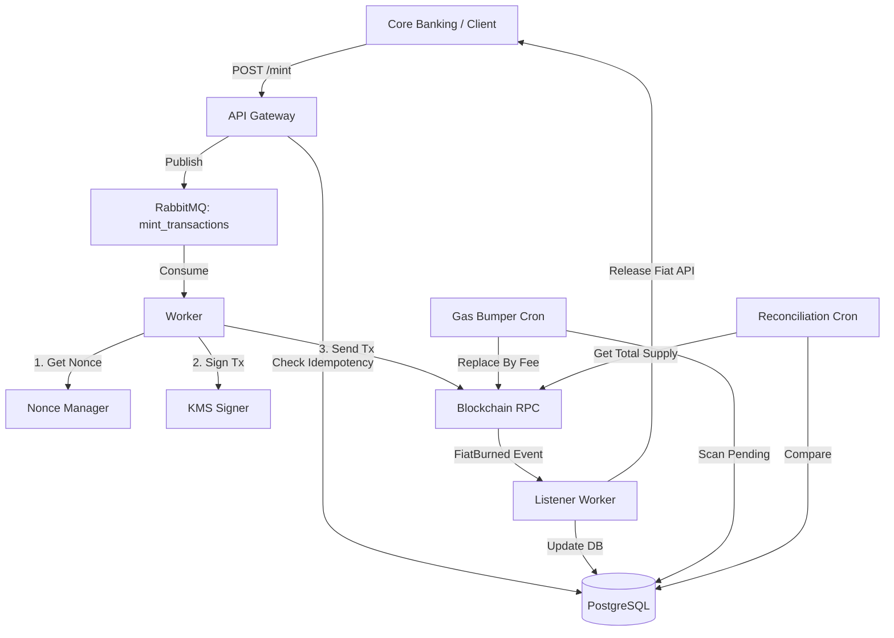

# Open-Source Fiat-to-SmartContract Bridge

The **Fiat-to-SmartContract Bridge** is an enterprise-grade middleware built in Go that securely connects traditional Core Banking systems with EVM-compatible blockchains. 

It handles the complex orchestration of minting digital tokens when fiat is locked, and burning tokens to release fiat back to the user, ensuring full atomicity, resiliency, and idempotency.

## 🚀 Features

- **Clean Architecture:** Organized in `api`, `domain`, and `infrastructure` layers.
- **Idempotency:** Prevents double-minting by verifying unique `core_tx_id` using a PostgreSQL database.
- **Saga Pattern & Message Queues:** Uses RabbitMQ for asynchronous processing. Features a Dead Letter Queue (DLQ) for transaction rollbacks if the blockchain minting fails repeatedly.
- **In-memory Nonce Manager:** Safely handles concurrent transactions without running into `Nonce too low` errors.
- **KMS Integration:** Protects Private Keys using a `Signer` interface (currently implemented as a Mock KMS, ready to swap to AWS KMS).
- **Gas Bumper Worker (Resiliency):** Automatically scans for pending transactions and performs Replace-by-Fee (RBF) to prevent network congestion delays.
- **Reconciliation Engine:** A cronjob that periodically checks the Blockchain's `totalSupply` against the local Database's successfully minted amount, alerting on any discrepancies.

## 🏗 Architecture



## 🛠 Prerequisites

- Go 1.22+
- Docker & Docker Compose
- Node.js (for Hardhat/Foundry contract compilation, optional)

## 📦 Installation & Setup

1. **Clone the repository:**
   ```bash
   git clone https://github.com/Quocthai23/fiat-bridge.git
   cd fiat-bridge
   ```

2. **Run Services via Docker Compose:**
   This will spin up PostgreSQL, RabbitMQ, and the Go Bridge application.
   ```bash
   make docker-up
   ```

3. **(Local Development) Build and Run the Go app manually:**
   ```bash
   make build
   make run
   ```

## 📡 API Reference

### Mint Tokens (Lock Fiat -> Mint Crypto)
**Endpoint:** `POST /api/v1/bridge/mint`

**Payload:**
```json
{
  "core_tx_id": "tx-123456789",
  "user_address": "0xYourEthereumAddress",
  "amount": 1000000
}
```

**Response (200 OK):**
```json
{
  "status": "pending_on_chain",
  "core_tx_id": "tx-123456789",
  "message": "Mint transaction published to queue"
}
```

## 📜 License
This project is licensed under the MIT License.
