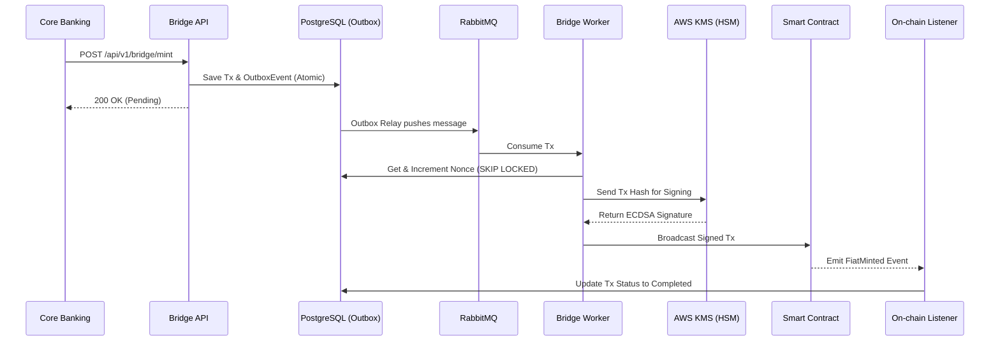

# 🌉 Enterprise Fiat-to-SmartContract Bridge


An enterprise-grade, two-way middleware bridging traditional Core Banking systems with EVM-compatible blockchains. Built for high-concurrency, zero-data-loss, and military-grade security.

---

## 🚀 Enterprise Architecture & Core Features

This bridge is not just a simple API wrapper. It is designed to solve complex Distributed Systems and Web3 challenges:

* **🔒 Military-Grade Security (AWS KMS):** Private keys are never exposed in plain-text. Implements AWS KMS Asymmetric Signing (`ECC_SECG_P256K1`) with strict EIP-2 malleability protection.
* **⚡ High Concurrency Ready:**
  * **Row-Level Locking:** Uses PostgreSQL `SKIP LOCKED` to safely allocate nonces across dozens of parallel worker pods without `Nonce too low` errors.
  * **Transactional Outbox Pattern:** Guarantees atomicity between DB transactions and RabbitMQ message publishing. No dual-write bugs.
* **🛡️ Self-Healing & Resiliency:**
  * **Auto Gas Bumper:** Actively monitors pending txs and applies EIP-1559 Replace-by-Fee (RBF) to rescue stuck transactions during network congestion.
  * **Eventual Consistency:** Independent Sync States (`LastMintBlock` / `LastBurnBlock`) protect against Chain Reorganizations and Pod Restarts.
  * **Dead Letter Queue (DLQ):** Failed transactions trigger a Webhook rollback to the Core Banking system, ensuring zero financial loss.
* **📊 Observability & Compliance:**
  * **Reconciliation Engine:** Periodic cronjobs verifying off-chain DB records against on-chain `TotalSupply` using big integer arithmetic to prevent overflow.
  * **Prometheus & Grafana:** Full monitoring stack included.

---

## 🏗️ System Architecture



---

## 🛠️ Tech Stack

* **Backend:** Golang 1.22, Gin-Gonic, GORM
* **Web3:** `go-ethereum` (Geth), OpenZeppelin, Hardhat
* **Infrastructure:** PostgreSQL, RabbitMQ, Docker, Helm / Kubernetes
* **Monitoring:** Prometheus, Grafana
* **Cloud:** AWS KMS (Key Management Service)

---

## 📦 Quick Start (Docker Compose)

Spin up the entire stack locally (Postgres, RabbitMQ, Prometheus, Grafana, and the Bridge application):

```bash
# 1. Clone the repository
git clone https://github.com/Quocthai23/fiat-bridge.git
cd fiat-bridge

# 2. Start the infrastructure and app
make docker-up
```

---

## ☸️ Kubernetes Deployment (Helm)

The project is fully ready for Kubernetes orchestration:

```bash
helm install fiat-bridge ./helm/fiat-bridge --namespace fiat-bridge --create-namespace
```

---

## 📡 API Endpoints

### 1. Lock Fiat & Mint Tokens

* **URL:** `/api/v1/bridge/mint`
* **Method:** `POST`
* **Headers:** `Content-Type: application/json`

**Request Body:**
```json
{
  "core_tx_id": "tx-12345",
  "user_address": "0xYourEVMAddress",
  "amount": "1000000000000000000" // In Wei (e.g., 1 Token)
}
```

### 2. Burn Tokens & Unlock Fiat

* **URL:** `/api/v1/bridge/burn`
* **Method:** `POST`
* **Headers:** `Content-Type: application/json`

**Request Body:**
```json
{
  "core_tx_id": "tx-67890",
  "user_address": "0xYourEVMAddress",
  "amount": "1000000000000000000"
}
```

---

## 🧪 Testing & CI/CD

The project includes strict Automated Testing to ensure financial integrity:

* **E2E Tests:** Full end-to-end simulation.
* **Chaos Engineering:** `chaos_test.go` simulates Database crashes, KMS timeouts, and RabbitMQ network failures.
* **CI/CD:** Automated via GitHub Actions including Slither Smart Contract Audits and Docker Image builds.

```bash
# Run tests locally
go test -v ./tests/...
```

---

## 📜 Smart Contract Capabilities

The `EnterpriseFiatToken.sol` is an upgradeable-ready ERC20 with:

* **AccessControl:** Strict isolation between `MINTER_ROLE` and `BURNER_ROLE`.
* **Pausable:** Circuit breaker for emergency halts.
* **Idempotency Mapping:** Prevents Replay Attacks at the EVM level.

---

## 🤝 License

This project is licensed under the MIT License.
